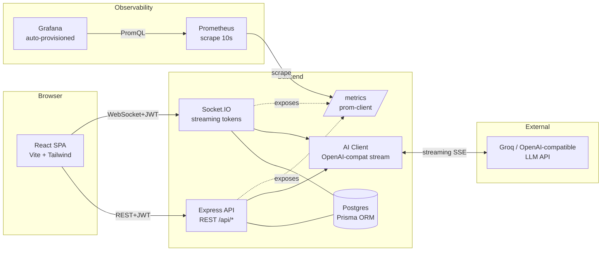

# AI Conversations Dashboard

> Multi-tenant dashboard to monitor, interact with, and analyze AI agent conversations.
> Features token-by-token streaming, observability with Prometheus + Grafana, and declarative infrastructure with Terraform on Render.


---

## 0 · Quick Access (Deployed)

- **Frontend (Web):** https://proyectosimon-frontend.onrender.com
- **Backend (API):** https://proyectosimon-backend.onrender.com
- **Demo Credentials:**

| Organization | Email | Password |
|---|---|---|
| Acme Corp | `alice@acme.com` | `password123` |
| Globex | `bob@globex.com` | `password123` |

> *Note: Render's free tier spins down after 15m of inactivity. The first login/request might take ~50 seconds to wake up the backend. Please be patient!*

---

## 1 · How to run locally (Docker)

### Configuration & API Key
1. Clone the repository.
2. Copy the environment variables template:
   ```bash
   cp .env.example .env
   ```
3. **Configure the AI API Key:** Open the newly created `.env` file and set the `AI_API_KEY` variable with your groq API key (get one for free at [console.groq.com](https://console.groq.com)).
   - *Note: If `AI_API_KEY` is left empty or invalid, the backend will gracefully fallback to a deterministic mock streamer so you can still fully test the UI without configuring third parties.*

### Start the services
Run the following command to spin up Postgres, the Backend, Frontend, Prometheus, and Grafana simultaneously:
```bash
docker-compose up --build -d
```

| Service | URL | Credentials |
|---|---|---|
| Frontend (SPA) | http://localhost:5173 | See Quick Access table above |
| Grafana | http://localhost:3000 | `admin` / `admin` (or anonymous read-only mode) |
| Prometheus | http://localhost:9090 | — |
| Backend API | http://localhost:4000 | — |

*On first boot, the backend container runs `prisma db push` and `prisma/seed.ts` automatically to safely create the organizations, users, personalities, and ~70 historical mock conversations.*

---

## 2 · Architecture Diagram



---

## 3 · Architecture & Models Decisions

### Stack Selection
- **Frontend:** React + Vite + TS + Tailwind. Excellent Developer Experience (DX), minimal ad-hoc CSS, and high performance.
- **State Management:** TanStack Query for server-state (caching/revalidation) and Zustand for simple client state (auth context).
- **Backend:** Node 20 + Express + TypeScript. Highly compatible with Socket.IO for seamless SSE/WebSockets event-driven connections.
- **Database:** PostgreSQL + Prisma ORM. Auto-generated types and easy relational modeling for rigid multi-tenancy.
- **Real-time:** Socket.IO. We use "Rooms" (`org:<orgId>`) to broadcast events safely and strictly within tenants.
- **AI Provider:** Groq API (LLaMA 3.1 8B Model). Offers an OpenAI-compatible endpoint with incredibly fast inference, perfect for testing seamless token-by-token streaming on a free tier.
- **Infrastructure as Code:** Terraform + Render. Render offers a great free tier for Docker containers.

### Conscious Trade-offs
- **`db push` vs `migrations`:** Used `db push` in the Dockerfile to speed up the MVP. In a production environment, `prisma migrate deploy` along with an unalterable migration history would be mandatory.
- **Worst Prompts Rating Threshold:** Real production environments require statistical significance (e.g., N > 20 per prompt). Here, the threshold is intentionally kept low to showcase the DB analytics logic immediately with seeded data.
- **Denormalized `orgId`:** `orgId` is replicated in the `Message` table. It avoids complex SQL JOINs when enforcing tenant isolation at the cost of duplicate data overhead, maintaining extremely fast read speeds.

---

## 4 · AI Tools Used

- **GitHub Copilot / Gemini 3.1 Pro:** Used heavily throughout the iterative development cycle as an AI automated agent. It assisted perfectly with:
  - Initial scaffolding of the React and Express codebases.
  - Dockerizing the application and writing the clean `docker-compose.yml` setup.
  - Formulating the Terraform IaC scripts to deploy effectively to Render.
  - Designing the Prisma schema to support strict multi-tenancy queries.
  - Implementing the Grafana dashboards JSONs and Prometheus container configurations.

---

## 5 · UX/UI Improvements & Innovation Detected (Justified)

1. **Empty States & Fallbacks:** The provided mockup lacked empty state visual indicators. We implemented explicit "—" (dashes) for empty KPIs instead of confusing "0"s, and explicit empty messages ("Start a conversation") to avoid silent UX failures.
2. **Real-time Streaming Feedback:** Added a naturally blinking cursor (`▍`) at the end of the text while the LLM generates the response, actively disabling the input field to prevent duplicate submissions or race conditions.
3. **Filters Reset Policy:** When changing table filters manually, the pagination properly resets to page 1 automatically preventing out-of-bounds queries. Added a 'Total Results' counter.
4. **Smart Rating Anchors:** Used graphical Star icons (`Lucide-react`) in the table instead of raw confusing numbers. The "Satisfactory" KPI explicitly clarifies its metric under the hood via a subtitle: *"Rating ≥ 4 over total rated"*.
5. **Inline Prompt Selector:** Allowed users to change the agent's personality (prompt) directly from the Chat Interaction view, saving them from navigating away to the Settings view just to test a different bot persona.
6. **Clickable Table Rows:** Rows react to hover and are fully clickable, improving navigation over traditional and precise "View" buttons.
7. **Strict Multi-tenant UI Context:** The sidebar continuously displays the active user's Organization Name so they never lose context of which tenant's data they are mutating.
8. **Demo Login Presets:** The initial Login screen features "Quick Login" buttons to access Acme Corp and Globex immediately. This removes friction for reviewers wanting to test multi-tenant boundaries out of the box.
9. **Toast Notifications System:** Used `react-hot-toast` for immediate feedback (e.g. Rating saved, Server Errors, Settings updated) replacing ugly and blocking native alert dialogs.

---

## 6 · Scope: What to review & what was left out

### ✅ What is complete and ready for review:
- **Strict Multi-tenancy Context:** Enforced via `orgId` on every single backend route and WebSocket room. A user from Acme cannot query, interact with, see, or receive real-time updates from Globex.
- **Token-by-Token Streaming:** Handled natively via WebSockets (events `assistant:delta`, `assistant:done`).
- **Cross-tab Real-time synced:** If you open the dashboard in two tabs side by side, engaging with a conversation in one instantly updates metrics and the table in the other tab.
- **Observability Stack:** Prometheus securely scrapes metric latencies and errors, and Grafana comes auto-provisioned with 7 informative panels (no manual setup required).
- **IaC Deploy Pipeline:** Terraform fully manages Postgres, Backend, and Frontend resources on `.onrender.com`.
- **CI/CD Pipeline:** GitHub Actions automatically tests linting and Docker image builds guaranteeing green badges on every push to `main`.
- **Mock Data Seeder:** The database automatically hydrates with historical mock conversations bridging the gap for analytics.

### ⚠️ What was left out (Deadline & Free tier constraints):
- **Automated Tests:** Unit or E2E tests (like Jest or Playwright) were intentionally skipped as noted in the prompt. If implemented, testing the multi-tenant isolation database layer would be the highest priority.
- **Rate Limiting:** Not implemented on the APIs. A production environment would require `express-rate-limit` preventing DDoS per IP and Org.
- **Refresh Tokens Lifecycle:** We opted to use straightforward 12h-lived JWTs for the MVP.
- **Virtualization:** The table uses a naive pagination. Very huge datasets would drastically require row virtualization.

---

## 7 · Additional Comments & Indications

- **WebSocket Fast Fallback:** If the WebSocket connection ever fails in production due to harsh enterprise proxies, Socket.IO is configured to gracefully fallback to HTTP Long-Polling.
- **Streaming Speed:** Groq's LLaMA inference is insanely fast; sometimes the streaming might feel "too quick" to look like a typical LLM generation. The mock streamer (active when without an API key) simulates a mathematically slower, more organic typing speed.
- **Database Persistence Locally:** Postgres uses an isolated local Docker volume `pgdata`. To completely purge the DB locally across boots, run `docker-compose down -v`.
