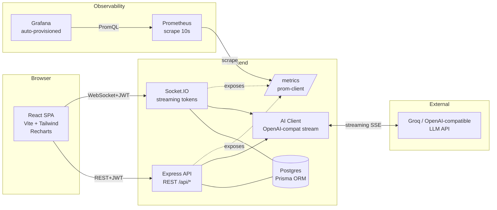

# Simon · AI Conversations Dashboard

> Dashboard multi-tenant para monitorear, interactuar y analizar conversaciones de agentes de IA.
> Respuestas en streaming (token-por-token), observabilidad con Prometheus + Grafana, e infraestructura declarativa con Terraform en Fly.io.


---

## 0 · Acceso rápido

- **URL desplegada:** _(rellenar tras `terraform apply` + `flyctl deploy`)_ → `https://<simon-web-xxx>.fly.dev`
- **Grafana local:** http://localhost:3000 (anónimo · admin/admin si quieres editar)
- **Prometheus local:** http://localhost:9090
- **Credenciales demo:**

| Organización | Email | Password |
|---|---|---|
| Acme Corp | `alice@acme.com` | `password123` |
| Globex | `bob@globex.com` | `password123` |

---

## 1 · Cómo arrancar (Docker)

```bash
# 1. Clona el repo y copia las variables de entorno
cp .env.example .env
# (opcional) pega tu AI_API_KEY de https://console.groq.com
#   Si queda vacía, el backend usa un streamer mock determinístico.

# 2. Levanta todo (Postgres + backend + frontend + Prometheus + Grafana)
docker compose up --build
```

Servicios expuestos:

| Servicio | URL | Credenciales |
|---|---|---|
| Frontend (SPA) | http://localhost:5173 | ver tabla arriba |
| Backend API | http://localhost:4000 | JWT por `/api/auth/login` |
| Backend `/metrics` | http://localhost:4000/metrics | — |
| Prometheus | http://localhost:9090 | — |
| Grafana (dashboard auto-provisioned) | http://localhost:3000 | admin / admin (o anónimo de solo-lectura) |
| Postgres | localhost:5432 | simon / simon |

Al primer arranque, el contenedor backend ejecuta:

1. `prisma db push` (sincroniza el esquema — no requiere migraciones manuales).
2. `prisma/seed.ts` (idempotente — crea 2 orgs, 2 usuarios, 4 prompts y ~70 conversaciones con mensajes).
3. Levanta el server Express + Socket.IO.

---

## 2 · Arquitectura



**Multi-tenancy**: todo dato tenant-scoped lleva `orgId` FK indexado.
El middleware `requireAuth` inyecta `req.auth.org_id` desde el JWT, y
**ninguna query del backend omite ese filtro**. Socket.IO valida JWT en el
handshake y une al socket a la room `org:<orgId>`, así los eventos
`conversation:created/updated/deleted` solo llegan a miembros de la misma org.

---

## 3 · Decisiones de arquitectura

### Stack

| Capa | Elección | Por qué |
|---|---|---|
| Frontend | **React + Vite + TS + Tailwind** | Vite = hot-reload rápido; Tailwind = diseño consistente con poco CSS ad-hoc |
| Estado cliente | **TanStack Query + Zustand** | RQ cachea y revalida con invalidación simple tras eventos WS; Zustand para auth (trivial) |
| Gráficos | **Recharts** | SVG, sin Canvas; adherencia al mockup; buena DX |
| Backend | **Node 20 + Express + TypeScript** | Ecosistema maduro, Socket.IO es first-class, streaming es natural |
| ORM / DB | **Prisma + PostgreSQL** | Tipos autogenerados; migraciones con `db push` (más simple que `migrate` para MVP); `$queryRaw` para analytics SQL |
| Real-time | **Socket.IO** | Rooms por org y por conversación → aislamiento multi-tenant gratis; fallback a polling si WS falla |
| IA | **Groq API (LLaMA)** | Free tier real sin tarjeta, OpenAI-compatible → cliente estándar, streaming SSE |
| Métricas | **prom-client** | Estándar Prometheus; histogramas con buckets ajustados |
| Infra | **Terraform + Fly.io** | Fly tiene free tier, soporte WS nativo y un provider Terraform dedicado; Postgres managed |
| CI | **GitHub Actions** | Lint + build + docker build + `terraform validate` |

### Trade-offs conscientes

- **`db push` en vez de migraciones versionadas.** Acelera el setup y es suficiente para MVP. En un entorno productivo real, agregaría `prisma migrate deploy` con historial de migraciones.
- **Prompt "worst rating" sin umbral mínimo estricto de muestras.** En producción requeriría al menos N=20 para significancia estadística. Se deja puerta abierta en `analytics.ts` con `HAVING COUNT >= 1` (trivial de subir).
- **Denormalización de `orgId` en `Message`.** Evita joins en filtros por tenant (especialmente en `worst-prompts` y agregaciones), a cambio de un campo duplicado que se mantiene consistente vía writes en el backend.
- **JWT en handshake de Socket.IO** (auth field), no en cookie. Más simple cross-origin y compatible con el mismo token del REST.
- **Mock streamer de IA si `AI_API_KEY` está vacía.** El sistema arranca 100% funcional sin credenciales externas → mejor DX para revisión/evaluación.
- **Free tier Fly.io (256 MB RAM).** Suficiente para una demo; bajo carga real requerirá escalar.
- **Seed se corre con `|| true`** en compose para no reventar si ya corrió (upserts lo hacen idempotente, pero protege de timings extraños).

---

## 4 · Herramientas de IA utilizadas

| Herramienta | Uso |
|---|---|
| **Claude Code** | Scaffolding inicial completo del repo, diseño del esquema Prisma, implementación del streaming WS, configuración de Terraform y Grafana |
| _(el resto del trabajo se hizo directamente sobre las sugerencias de Claude, ajustando manualmente)_ | |

Todo el código de este repo fue revisado línea por línea antes de commitear. Las decisiones de producto (multi-tenancy, diseño de métricas, estructura del dashboard) son propias; Claude aceleró la implementación y el boilerplate.

---

## 5 · Mejoras UX/UI detectadas y justificación

### Problemas del mockup (lovable) y qué hice

1. **Mockup muestra valores estáticos, sin indicador de "no datos".** → KPI cards muestran `—` explícitamente cuando no hay datos, evitando que el usuario interprete "0" como un valor real vs. ausencia de datos.
2. **No había feedback visual durante el streaming.** → Cursor parpadeante (`▍`) al final del texto mientras el LLM genera; deshabilita el input durante la generación para prevenir dobles envíos.
3. **Filtros sin reset ni contador.** → La tabla muestra el total de resultados filtrados y la paginación se resetea a página 1 al cambiar filtros.
4. **Ratings sin ancla semántica.** → Uso de estrellas (`Star` de Lucide) en lugar de números crudos en la tabla; mantiene el número en el KPI de resumen.
5. **Cards "satisfactorias" no dejan claro cómo se mide.** → Hint explícito _"Rating ≥ 4 sobre total puntuadas"_ debajo del valor.
6. **Tabla sin feedback al hacer hover/click.** → Hover state + cursor pointer + navegación a detalle con un solo click (en vez de un botón "Ver").
7. **Toast de éxito/error.** → `react-hot-toast` para feedback inmediato de acciones (calificar, crear, eliminar), reemplaza diálogos nativos.
8. **Selector de prompt inline en el chat.** → El usuario puede cambiar "personalidad" sin salir del chat (en el mockup estaba solo en Configuración).
9. **Sidebar con avatar + org del usuario.** → Contexto permanente de _en qué tenant estoy_, crítico en multi-tenancy para prevenir confusión.
10. **Empty states explícitos.** → "Envía el primer mensaje para comenzar", "Sin conversaciones", "Sin datos suficientes" en vez de tablas/gráficos vacíos mudos.
11. **Login con presets de usuarios demo.** → Dos botones (`Acme Corp`, `Globex`) que pre-rellenan credenciales: hace trivial verificar multi-tenancy en una revisión.
12. **Accesibilidad**: `title` en iconos, foco visible con ring, contraste WCAG AA en todos los badges.

### Mejoras que **no** alcanzaron

- Dark mode (Tailwind está listo, faltó exponer toggle).
- Virtualización de la tabla (ok hasta ~1k rows con paginación server-side).
- Exportar reportes (CSV/PDF) — era una idea pero sobreingeniería para el scope.
- Notificaciones push del navegador para conversaciones entrantes.

---

## 6 · Alcance — qué revisar y qué quedó fuera

### ✅ Qué revisar (completo)

- **Autenticación JWT** con `org_id` en claims → [`backend/src/auth/`](backend/src/auth/).
- **Multi-tenancy estricta** en todas las queries → busca `orgId: req.auth!.org_id` o `where.orgId` en [`backend/src/routes/`](backend/src/routes/). Un usuario de Acme nunca ve datos de Globex, ni por REST ni por WS.
- **Streaming token-por-token** → [`backend/src/ws/index.ts`](backend/src/ws/index.ts) y [`frontend/src/pages/Chat.tsx`](frontend/src/pages/Chat.tsx). Eventos `assistant:start/delta/done/error`.
- **Real-time cross-tab**: abre dos pestañas con el mismo usuario, crea una conversación en una → aparece en la otra sin refrescar.
- **4 vistas + sidebar** → [`frontend/src/pages/`](frontend/src/pages/). Resumen, Conversaciones, Chat, Analytics, Configuración.
- **Observabilidad** → arranca `docker compose up`, abre Grafana en `:3000`, ve al folder "Simon" → dashboard pre-cargado con 7 panels.
- **Terraform** → `cd terraform && terraform init && terraform apply -var=fly_api_token=...` (requiere `flyctl auth login`).
- **CI verde** → `.github/workflows/ci.yml` corre lint, build TS, docker build y `terraform validate` en cada push.
- **4 prompts seed** con persona diferente → `prisma/seed.ts`.

### ⚠️ Qué quedó fuera o simplificado (por tiempo)

- **Tests automatizados**: el enunciado los marca como no obligatorios; no hay suite de unit/e2e. Si fueran requisito real, priorizaría tests de la capa multi-tenant (que una query con `orgId` equivocado no retorne filas).
- **Refresh tokens**: solo JWT simple con 12h de expiración. Para producción usaría rotación con refresh.
- **Rate limiting**: no implementado. Un `express-rate-limit` por IP + por org iría en el `index.ts`.
- **Migraciones versionadas**: uso `db push` por simplicidad. Para rollbacks/auditoría serviría `prisma migrate`.
- **Deploy auto en CI**: el pipeline valida pero no deploya. Agregar un step con `flyctl deploy` detrás de un secret era trivial pero quedaba fuera del requisito.
- **Internacionalización**: todo en español. Si hiciera falta EN, usaría `react-i18next` con namespaces por vista.
- **Tests de carga** para validar el free tier de Fly bajo WS concurrentes reales.

---

## 7 · API resumen

```
POST /api/auth/login          { email, password } → { token, user }
GET  /api/auth/me             → user

GET  /api/conversations       ?page=&pageSize=&status=&channel=&minRating=&from=&to=
GET  /api/conversations/:id
POST /api/conversations       { title?, channel? }
POST /api/conversations/:id/rate  { rating: 1..5 }
POST /api/conversations/:id/close
DEL  /api/conversations/:id

GET  /api/analytics/summary
GET  /api/analytics/trend       (últimos 30 días)
GET  /api/analytics/ratings     (histograma 1..5)
GET  /api/analytics/channels    (pie web/whatsapp/instagram)
GET  /api/analytics/worst-prompts

GET  /api/prompts
POST /api/prompts               { name, content }
POST /api/prompts/:id/set-default
DEL  /api/prompts/:id

GET  /health
GET  /metrics                   (Prometheus exposition)
```

### Eventos WebSocket

Cliente → servidor: `conversation:join <id>`, `conversation:leave <id>`, `message:send {conversationId, content, promptId?}`

Servidor → cliente: `conversation:created|updated|deleted`, `message:new`, `assistant:start`, `assistant:delta`, `assistant:done`, `assistant:error`.

---

## 8 · Observabilidad — qué hay en Grafana

Dashboard provisionado en `observability/grafana/provisioning/dashboards/simon-backend.json`:

1. **Request rate** — `sum by (path) (rate(http_requests_total[1m]))`
2. **HTTP p95 latency** — `histogram_quantile(0.95, …http_request_duration_seconds_bucket…)`
3. **Error rate (5xx %)** — stat con thresholds (verde < 1%, naranja 1-5%, rojo > 5%)
4. **WebSocket active connections** — `sum(ws_active_connections)`
5. **AI API latency p95** — por modelo y status
6. **Requests by status code** — stacked area
7. **AI API request rate** — por status (ok / error / exception)

Al hacer `docker compose up` por primera vez, el dashboard aparece en Grafana → folder "Simon" sin tocar nada.

---

## 9 · Estructura del repo

```
.
├── backend/              # Node + Express + Socket.IO + Prisma
│   ├── prisma/           # schema.prisma + seed.ts
│   ├── src/
│   │   ├── auth/         # JWT middleware + login/me routes
│   │   ├── routes/       # conversations, analytics, prompts
│   │   ├── ws/           # Socket.IO server + streaming
│   │   ├── ai/           # OpenAI-compatible streaming client
│   │   ├── metrics.ts    # prom-client registry + middleware
│   │   └── index.ts      # entry
│   └── Dockerfile
├── frontend/             # React + Vite + TS + Tailwind
│   ├── src/
│   │   ├── pages/        # Resumen, Conversaciones, Chat, Analytics, Configuración, Login
│   │   ├── components/   # Sidebar, Layout, KpiCard, ProtectedRoute
│   │   ├── lib/          # api client, socket, utils
│   │   └── stores/       # Zustand auth
│   ├── Dockerfile        # multi-stage build → nginx static
│   └── nginx.conf
├── observability/
│   ├── prometheus/prometheus.yml
│   └── grafana/provisioning/  (datasources + dashboards + JSON)
├── terraform/            # Fly.io IaC
│   ├── main.tf  variables.tf  outputs.tf  versions.tf
│   └── README.md
├── .github/workflows/ci.yml
├── docker-compose.yml
├── .env.example
└── README.md
```

---

## 10 · Comentarios e indicaciones adicionales

- **Si el streaming se ve "entrecortado"**: normal. La tasa de emisión depende del proveedor (Groq es rápido; el mock emite cada 25-85 ms).
- **Grafana tarda ~30 s** en tener datos después del primer `docker compose up` (scrape interval + warmup).
- **Cambio de región de Fly**: editar `var.region` en `terraform/variables.tf` (por defecto `scl` / Santiago).
- **Variables sensibles**: nunca en el repo. `.env` está en `.gitignore`. En Fly se setean vía `flyctl secrets set` después del `terraform apply` si se prefiere.
- **Postgres local se persiste** en el volumen `pgdata`. Para resetear: `docker compose down -v`.

Si encuentras algún detalle roto o querés ver una decisión en profundidad, los archivos relevantes están linkeados desde este README. Gracias por la revisión 🪖.
